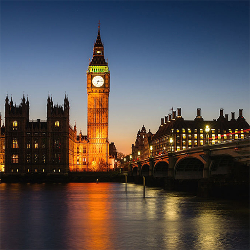
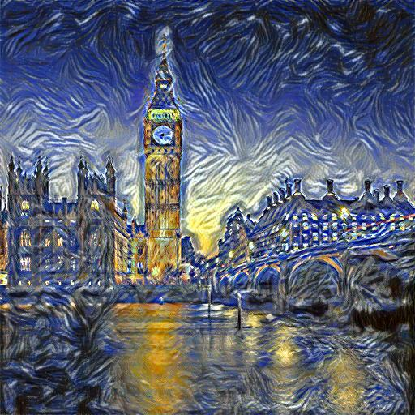
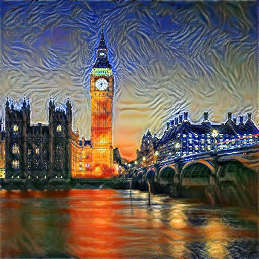

# Neural multistyle transfer
An generalization and implementation of [neural style][paper] for images and videos in PyTorch.
Highly recommended to have a GPU to speed up the optimization process. 
A 512x512 image typically takes approximately 20 seconds on a 2070.
The algorithm operates on videos frame-by-frame, so it can take hours depending on the resolution and size of the video. 

## Running for images and videos
`python3 neural multistyle.py --content <content file> --styles <style file> --output <output file>`
### Additional arguments
| Arguments | Description |
| --------- | ----------- |
| `content` | The image or video to retain content from. |
| `styles` | The images to transfer style from. |
| `output` | Destination of output. Defaults to `output.jpg` or `output.mp4` |
| `epochs` | The number of epochs to run the LBFGS optimization algorithm for. Defaults to `301`. |
| `content_weight` | A hyperparameter scalar for the importance of retaining the contents of the content image. Defaults to `1`. |
| `style_weights` | A hyperparameter scalar for the importance of retaining the styles of the style images. Defaults to `1e6`. |
| `style_weights` | A list of hyperparameter scalars for the importance of each style image. The number of scalars needs to be equal to the number of style images and they must sum to 1. Default is `[1/n]` where `n` is the number of style images. | 
| `verbose` | Flag for printing the loss value at every iteration. Defaults to `False` |

## Examples

### Neural style transfer on an image
| Content Image | Style Image | Output Image | Progression |
| ------------- | ----------- | ------------ | ----------- |
|  |  |  |  

### Neural multi-style transfer on an image
The video linearly transitions from style image to another.
| Content Image | Style Image 1 | Style Image 2 | Output Image |
| ------------- | ------------- | ------------- | ------------ |
|  |  |  |  |

### Neural style transfer on a video
 
 

### Neural multi-style transfer on a video

 

[paper]: http://arxiv.org/pdf/1508.06576v2.pdf